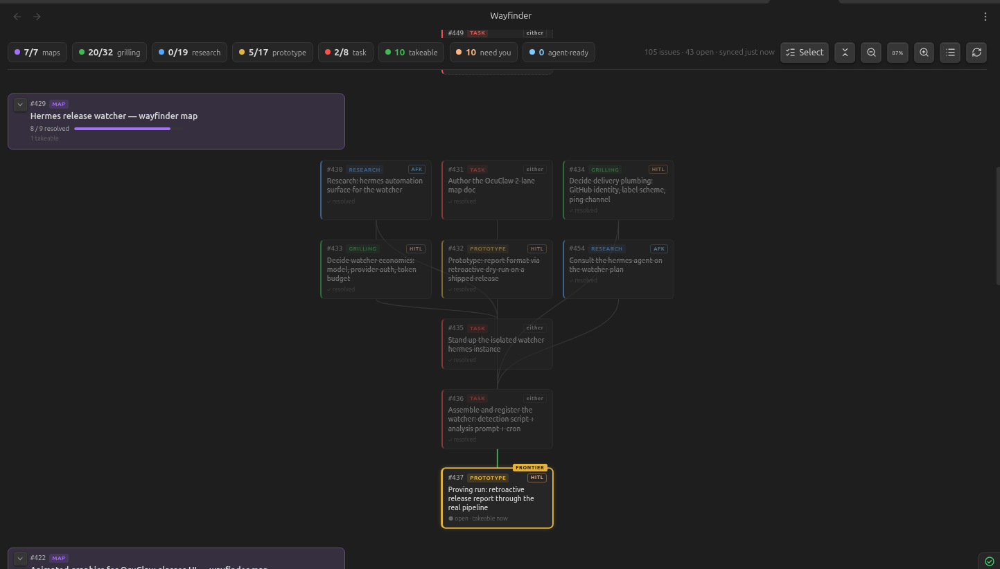

# Wayfinder Maps for Obsidian

Visualizes wayfinder maps from a GitHub repo's issues inside Obsidian: each `wayfinder:map` issue renders as a head card with its tickets arranged in a **dependency-layered tree** below it, drawn from GitHub's native issue-dependency (blocked-by) edges.

The wayfinder skill and methodology this plugin visualizes — maps, tickets, frontier, AFK/HITL delegation — come from [Matt Pocock's skills repo](https://github.com/mattpocock/skills); this plugin just draws what that workflow puts in your issues. Plugin 1.x is aligned to the v1.1.0 skills release.



## What it shows

- **Global tally bar** — open/total chips per `wayfinder:*` type, plus takeable, need-you, agent-ready, and either delegation chips, last-sync time, refresh, view-mode, fold, and zoom controls. Tallies always cover the shown repositories, independent of map focus and display filters.
- **Map navigation + filters** — choose All maps or one repository-qualified map, include or hide completed maps, and optionally show only incomplete tickets. Open maps are expanded newest first; completed maps are collapsed with a final progress bar. Click/tap a map header to expand or collapse it; ⓘ opens its details.
- **Tree, list + hybrid modes** — dependency-layered trees draw the actual blocker routes; compact lists group tickets by actionability; hybrid combines both views side by side in wide panes and stacks them in narrow panes. List is the mobile default.
- **Ticket state** — the **frontier** (open + verified unblocked + unassigned) glows with a FRONTIER flag; blocked tickets are dashed with a 🔒 naming open blockers; resolved tickets are dimmed with strikethrough.
- **Type + mode badges** — the `wayfinder:*` label colors each card; AFK/HITL is derived per the wayfinder skill (research→AFK, prototype/grilling→HITL, task→`ready-for-agent`/`ready-for-human` labels, else "either").
- **Orphan warnings** — `wayfinder:*` tickets whose "Part of #N" parent is missing or isn't a map get flagged instead of silently vanishing.
- **Ticket details + actions** — click/tap a ticket for a modal with its rendered Markdown description, linked blockers, assignee, live-fetched comments, and Copy `/wayfinder` / Open-on-GitHub buttons. The ⧉ on every card copies immediately; on takeable tickets it first checks for a new claim or resolution and replaces the action with a warning when necessary. ↗ opens GitHub.
- **Per-device view state** — map focus, display filters, view mode, and zoom are stored locally on each device. Use the toolbar, Ctrl/Cmd+wheel, or pinch to adjust zoom.

## Setup

1. Install **Wayfinder Maps** from Settings → Community plugins and enable it.
2. Create a **fine-grained personal access token** (github.com → Settings → Developer settings → Fine-grained tokens) scoped to your repo with read-only **Issues** permission — the plugin only ever reads issues.
3. In Settings → Wayfinder Maps, set the repo (`owner/name`) and paste the token, then open the view via the compass ribbon icon or the "Open Wayfinder view" command.

The view syncs when opened, re-polls every 2 minutes (configurable) while open, and syncs on window focus when stale. Commands cover **Open Wayfinder view**, **Sync now**, and **Copy /wayfinder for the next takeable ticket**. The manual refresh button forces a full relationship re-fetch. Note: the token is stored in plain text in the vault's plugin `data.json`, so treat that file (and anything that syncs it) accordingly.

## Development

```bash
npm install
npm run dev      # watch build
npm run build    # typecheck + production build
npm run deploy   # build + copy into the vault (set VAULT via env or deploy.env)
GH_TOKEN=$(gh auth token) SMOKE_REPO=owner/name npm run smoke   # run the data pipeline against a live repo
```

Manual install (without the community directory): copy `main.js`, `manifest.json`, `styles.css` into `<vault>/.obsidian/plugins/wayfinder-maps/`, then enable the plugin in Settings → Community plugins.
